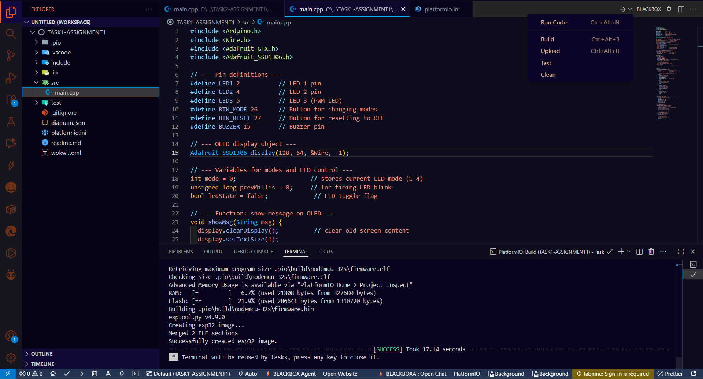
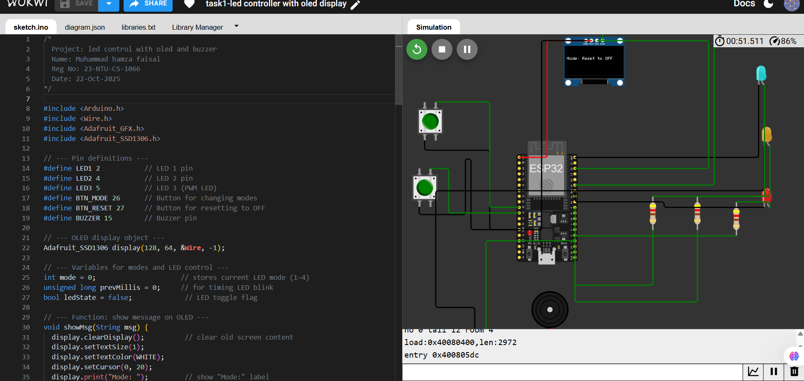
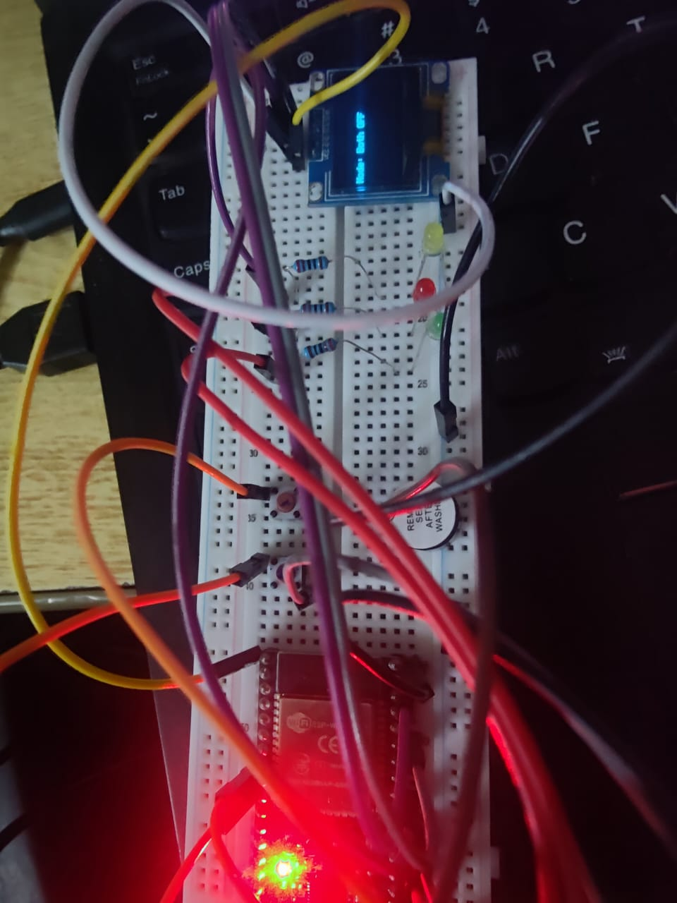
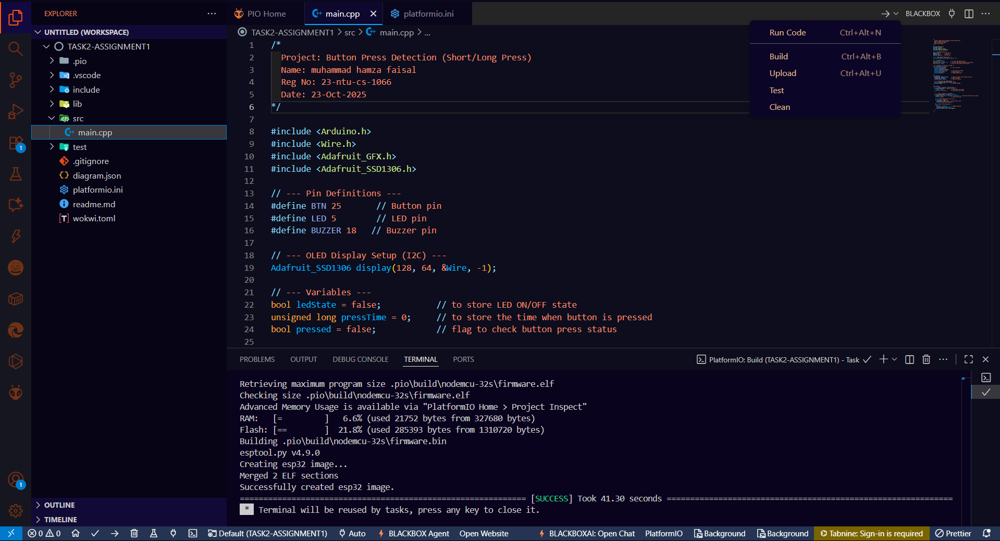
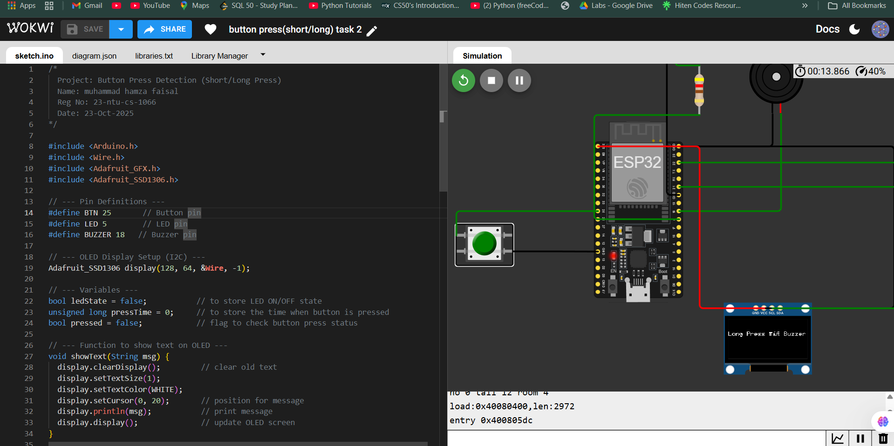
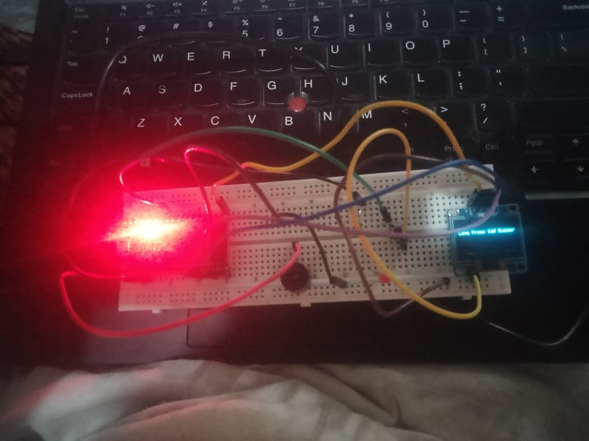

# Assignment 1 – Embedded IoT Systems  
**Name:** Muhammad Hamza Faisal  
**Reg No:** 23-NTU-CS-1066  
**Course:** Embedded IoT Systems  
**Instructor:** Sir Nasir Mehmood  
**Date:** 26-Oct-2025  

---

## 🧭 Overview
This assignment contains **two ESP32-based projects** developed and tested on the **Wokwi Simulator**.  
Both projects demonstrate hardware interfacing, sensor input handling, and OLED-based visual feedback.

---

## 🔹 Task 1 – Multi-Device Control using ESP32 (LEDs, Buttons, Buzzer & OLED)

### 📖 Description
ESP32 controls three LEDs, two buttons, and a buzzer with visual messages on an OLED.  
Buttons toggle LEDs and buzzer states, and the OLED updates accordingly in real-time.

### 🧰 Components Used
- ESP32 DevKitC V4  
- OLED 128x64 (I2C)  
- LEDs × 3  
- Buzzer × 1  
- Push Buttons × 2  
- 420Ω Resistors × 3  
- Jumper wires  

### 📡 Pin Map

| Component | Pin Name | GPIO No. |
|------------|-----------|----------|
| LED 1 | D2 | GPIO 2 |
| LED 2 | D4 | GPIO 4 |
| LED 3 | D5 | GPIO 5 |
| Button 1 | D26 | GPIO 26 |
| Button 2 | D27 | GPIO 27 |
| Buzzer | D15 | GPIO 15 |
| OLED SDA | SDA | GPIO 21 |
| OLED SCL | SCL | GPIO 22 |

### ▶️ How to Run
1. Open the folder `TASK1-ASSIGNMENT1` in **PlatformIO** or **Arduino IDE**.  
2. Connect the components as shown above.  
3. Upload the code to the ESP32 or open it on **Wokwi**.  
4. Press the buttons to toggle LEDs and buzzer — observe OLED messages update in real-time.

### 🔗 Wokwi Project Link  
👉 [View Simulation on Wokwi](https://wokwi.com/projects/445706554966735873)

### 🖼️ Screenshots  
| Image | Description |
|--------|--------------|
|  | Code open in VS Code |
|  | Simulation on Wokwi |
|  | Physical hardware setup |

---

## 🔹 Task 2 – Button Press Duration Detection (Short / Long Press with OLED)

### 📖 Description
This task detects **short and long button presses** using the ESP32.  
A short press toggles the LED, and a long press activates a buzzer. The OLED provides visual feedback.

### 🧰 Components Used
- ESP32 DevKitC V4  
- OLED 128x64 (I2C)  
- Push Button × 1  
- LED × 1  
- Buzzer × 1  
- Resistor × 1  

### 📡 Pin Map

| Component | Pin Name | GPIO No. |
|------------|-----------|----------|
| LED | D5 | GPIO 5 |
| Button | D25 | GPIO 25 |
| Buzzer | D18 | GPIO 18 |
| OLED SDA | SDA | GPIO 21 |
| OLED SCL | SCL | GPIO 22 |

### ▶️ How to Run
1. Open the folder `TASK2-ASSIGNMENT1` in **PlatformIO** or **Arduino IDE**.  
2. Connect the circuit as per the pin map.  
3. Upload the sketch or open it on **Wokwi**.  
4. Perform short and long button presses to see different actions on the LED, buzzer, and OLED display.

### 🔗 Wokwi Project Link  
👉 [View Simulation on Wokwi](https://wokwi.com/projects/445798744803145729)

### 🖼️ Screenshots  
| Image | Description |
|--------|--------------|
|  | Code open in VS Code |
|  | Simulation on Wokwi |
|  | Physical hardware setup |

---

## 🧰 Tools & Technologies Used
- **ESP32 DevKitC V4**  
- **PlatformIO** / **Arduino IDE**  
- **Wokwi Simulator**  
- **Adafruit GFX & SSD1306 Libraries**  
- **C / C++ (Arduino Framework)**  

---

## 🏁 Conclusion
Both tasks demonstrate key **Embedded IoT concepts**:
- GPIO input/output handling  
- I²C communication with OLED displays  
- Button state detection and debouncing  
- PWM and buzzer control  
- Integration of multiple peripherals with ESP32  

✅ **Successfully implemented and simulated on Wokwi.**

---

**Submitted by:** Muhammad Hamza Faisal  
 *Department of Computer Science, National Textile University*  
 *Fall 2025*
